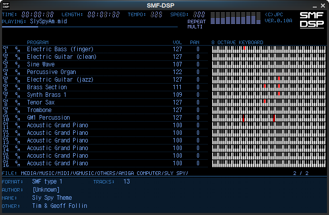

# smf-dsp

Advanced MIDI file player for desktop computer

# Keys

The keys are recognized by physical location and not label.

The listed key names are based on the QWERTY keyboard type, it will vary for a different type of layout.

| Key        | Function                                                                     |
|------------|------------------------------------------------------------------------------|
| F1         | Open the help screen                                                         |
| F2         | Select a MIDI device for playback                                            |
| F3         | Select a synthesizer device for playback                                     |
| F4         | Configure global audio effects                                               |
| F9         | Select a theme for the user interface                                        |
| F12        | Open the configuration directory                                             |
| Tab        | Switch between file browser and track info                                   |
| Esc        | Quit the program                                                             |
| -          | Decrement the proportional window size                                       |
| =          | Increment the proportional window size                                       |
| Page ↑     | Go to previous track in playlist/folder                                      |
| Page ↓     | Go to next track in playlist/folder                                          |
| Space      | Pause or unpause                                                             |
| Home       | Seek to beginning of current track                                           |
| End        | Seek to end of current track                                                 |
| ←↕→        | Navigate in the file browser                                                 |
| ←→         | In track info view, seek track by ± 5 seconds                                |
| Shift + ←→ | In any view, seek track by ± 10 seconds                                      |
| [          | Decrease speed by 1%                                                         |
| ]          | Increase speed by 1%                                                         |
| `          | Switch between repeat modes: On/Off, and Single/Multi                        |
| /          | Scan songs in the current folder of the file browser and play them at random |

# Building

To build the software, type these commands in the source directory.

- `mkdir build`
- `cd build`
- `cmake -DCMAKE_BUILD_TYPE=Release ..`
- `cmake --build .`

Install following packages on Debian/LibraZiK/Mint:

- `build-essential` `git` `pkg-config` `libsdl2-dev` `libasound2-dev` `libpulse-dev` `libjack-jackd2-dev` `libuv-dev` `libuchardet-dev`

(in case JACK 1 is preferred over JACK 2, replace `libjack-jackd2-dev` with `libjack-dev`)

Immediately after building, the program is available by starting `./smf-dsp`.

## Building synthesizers

The optional synthesizers have additional requirements, and they are built only if these are present.

- **Fluidsynth**: check out the `thirdparty/fluidlite` submodule.
- **FM-OPL3 (ADLMIDI)**: check out the `thirdparty/libADLMIDI` submodule.
- **FM-OPN2 (OPNMIDI)**: check out the `thirdparty/libOPNMIDI` submodule.
- **SCC (emidi)**: check out the `thirdparty/scc` submodule.
- **MT32EMU**: check out the `thirdparty/munt` submodule.
